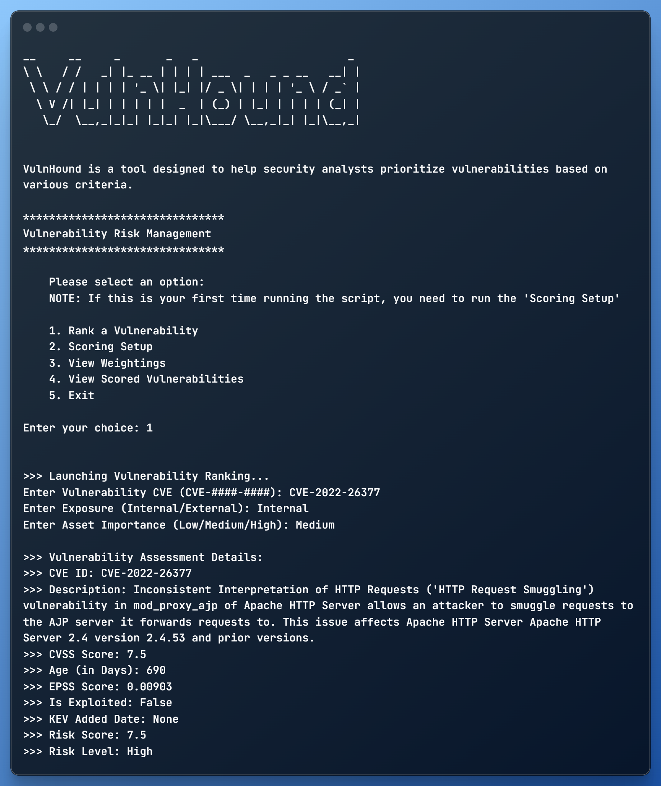

# VulnHound Risk Calculator

VulnHound Risk Calculator is a Python script designed to take a CVE (Common Vulnerabilities and Exposures) and determine the risk level of the vulnerability based on the CVSS (Common Vulnerability Scoring System) score, age of the vulnerability, EPSS (Exploit Prediction Scoring System) score, and exposure level.


### Prerequisites

**Note:** VulnHound uses the `cvemap.exe` utility from Project Discovery's CVEMap project. Before running VulnHound, make sure to [install CVEMap](https://github.com/projectdiscovery/cvemap).
### Functions

#### get_user_input()
Prompts the user to provide input for the vulnerability CVE, exposure, and asset criticality. Returns a tuple of these three values.

#### parse_vulnerability(vuln_cve)
Takes a vulnerability's CVE as an argument and returns a tuple of the following data: CVE ID, CVE description, CVSS score, age in days, EPSS score, is it exploited, and KEV added date.

#### rank_vulnerability(cvss_score, age_in_days, epss_score, vuln_exposure, asset_criticality, kev_added_date)
Ranks a vulnerability based on different factors such as CVSS score, age, EPSS score, asset criticality, and KEV added date. This function returns the risk score and risk level.

#### write_to_csv(cve_id, cve_desc, cvss_score, age_in_days, epss_score, is_exploited, kev_added_date, risk_score, risk_level)
Writes a vulnerability's data to a CSV file named 'vulnerabilities.csv'.

#### search_vulnerabilities(search_string)
Searches for a specific string in the vulnerabilities database.

#### scoring_setup()
Allows the user to input weightings for different scoring factors and saves those weightings in a JSON file named 'setup.json'.

#### view_weightings()
Prints out the current weightings for different scoring factors from the 'setup.json' file.

#### view_scored_vulnerabilities()
Displays a table of previously scored vulnerabilities.

### How to Run

To run the script, navigate to the directory containing the script in your terminal and execute the following command:

```bash
python vulnHound.py
```

The script will guide you through the process.

### Disclaimer

This script is for illustrative purposes only. The author is not responsible for the outcome of your decision to prioritize or remediate vulnerabilities based on the output of this script. Always consult with a qualified security professional when making decisions about vulnerability management.


